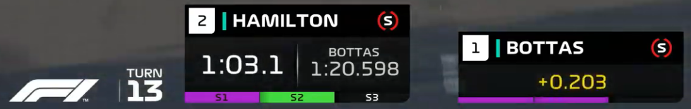

# FastF1 Predictions

## Overview

FastF1 Predictions is an innovative project aimed at predicting lap times in Formula 1 using telemetry data. Accurate lap time predictions are crucial in Formula 1 as they can influence strategic decisions during races, qualifying, and practice sessions. By leveraging advanced machine learning algorithms, FastF1 Predictions seeks to provide precise and reliable predictions to enhance the competitive edge of teams and drivers.



## Purpose

The primary goal of FastF1 Predictions is to utilize historical race data and telemetry to forecast lap times. This predictive capability can aid in optimizing race strategies, making informed decisions on tire changes, and evaluating driver performance. The project employs machine learning techniques, specifically Random Forest and Gradient Boosted Decision Trees, to build robust predictive models.

## Project Structure

Currently, the project includes:

- **notebooks/**: A directory containing Jupyter notebooks.
  - **[sector-3-time-prediction.ipynb](./notebooks/sector-3-time-prediction.ipynb)**: A demonstration notebook showcasing how to use the algorithms to predict lap times based on historical telemetry data.

Future updates will expand the repository with more resources, including additional notebooks, scripts, and enhanced functionalities.

## Setup Instructions

To get started with FastF1 Predictions, follow these steps:

### Prerequisites

Ensure you have Python installed (version 3.9).

### Installation

1. Clone the repository:

   ```sh
   git clone https://github.com/Draichi/fastf1-predictions.git
   cd fastf1-predictions
   ```

2. Create a virtual environment:

   ```sh
   # Using Conda (recommended)
   conda env create --file environment.yml
   ```

### Running the Notebook

1. Launch Jupyter Notebook:

   ```sh
   jupyter
   ```

2. Open `sector-3-time-prediction.ipynb` and run the cells to see the lap time prediction in action.

## Vision for the Future

The potential for FastF1 Predictions is immense. As we continue to gather more data and refine our models, we aim to incorporate additional data sources such as weather conditions. Moreover, we plan to explore advanced modeling techniques, including deep learning, Agent LLM and reinforcement learning methods, to further enhance prediction accuracy.

Stay tuned for updates, and thank you for your support!

---

Feel free to reach out if you have any questions or need further assistance. Happy predicting!
